# dotNet5781_6859_2304
college second year first semester project
written in c# based on three layer model with an xml database
(by the way we made a program that convert a list of object knowing his class property into xml file. link:"https://github.com/sam9875/c-list-to-xml-converter")
the software is a transportation system based in israel including bus lines from different areas and stations(with gps coordonates).

bonus:-- possibility to update time and distance between stations into a line 
      -- possibility to delete stations into a line 
      -- bus class in DO
      -- bus on trip class in DO
      -- user class in DO
      -- we have implemented buses partly (ui +xml)

software presentation:
when you get into the software click on administration 

then you can see our ui pages, the first that appears is buses

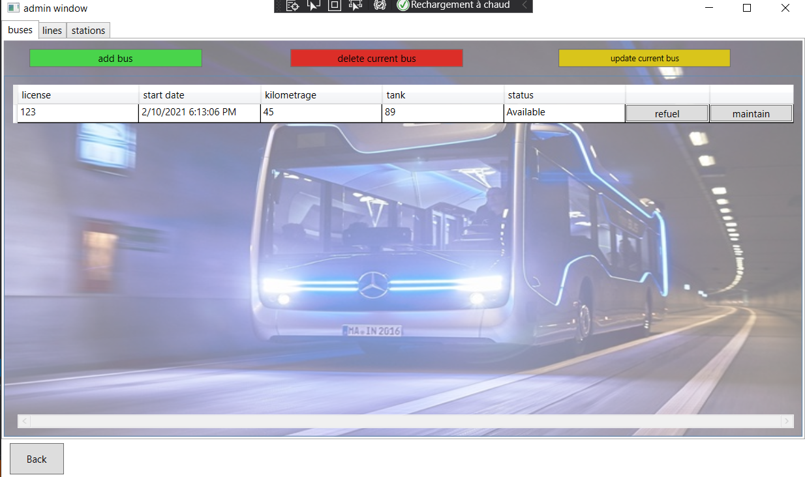

but you can navigate through others for example line, where you can see all the lines with for each one the stations and info about each station in the actual line

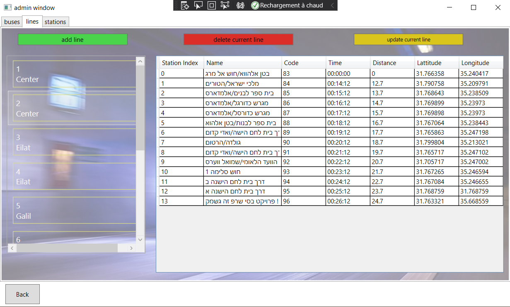

you can add a line

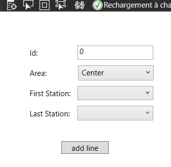

or update one meaning remove stations from the line or update time and distance between stations

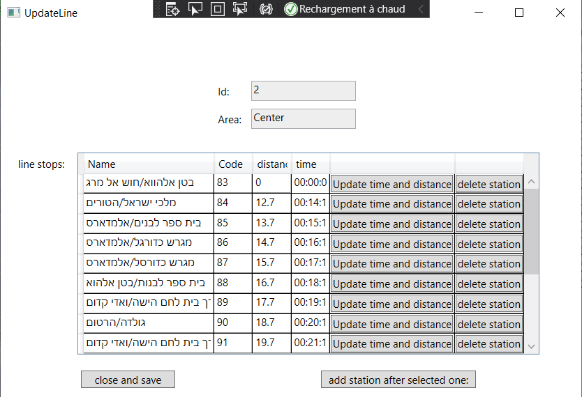

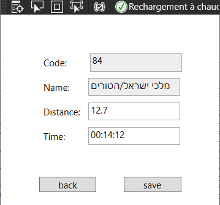

you can also go to stations page

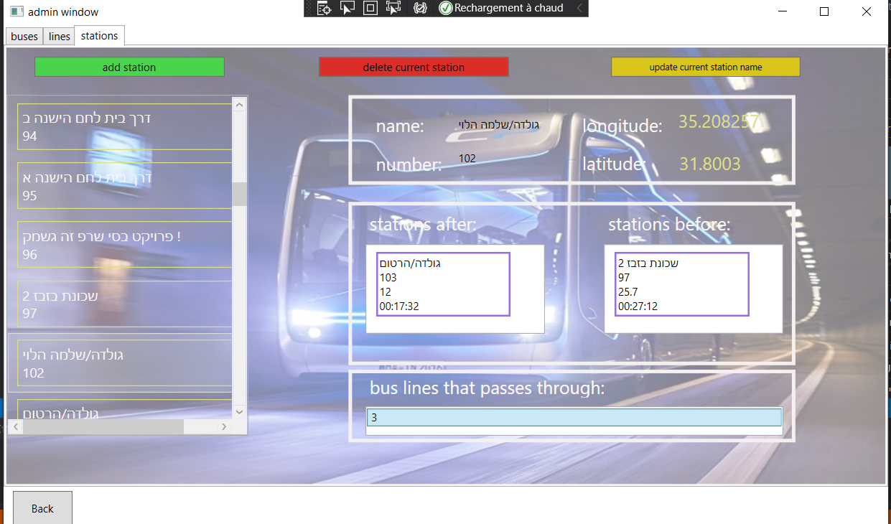

add a station

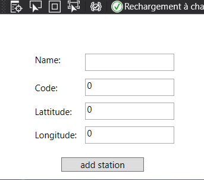

or update one

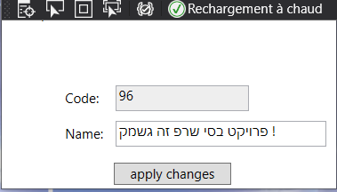

all the data base are saved in xml files 

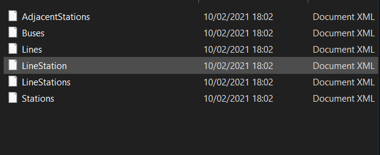

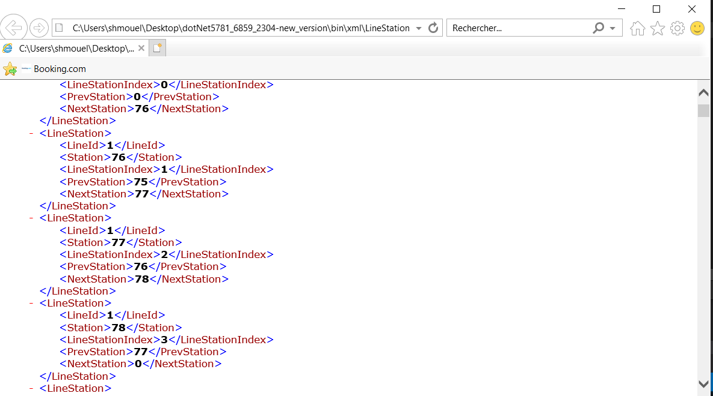

our classes in DO:

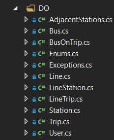

